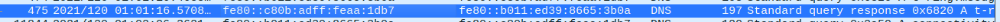

<h1>PacketMaze-CyberDefenders WriteUp</h1>

**Scenario:**
As an analyst working for a security service provider, you have been tasked with analyzing a packet capture for a customer's employee whose network activity has been monitored for a while -possible insider.

[Challenge Link](https://cyberdefenders.org/blueteam-ctf-challenges/68)
___
<h1>main tools:</h1>

1. wireshark
2. Mac Address LookUp from dnschecker.org
___
<h3>CHALLENGE QUESTIONS</h3>

**Q1.** What is the FTP password?

In wireshark if we filter by **FTP** traffic we will find username and password to login to server

**Answer:** AfricaCTF2021
___

**Q2.** What is the IPv6 address of the DNS server used by 192.168.1.26? (####::####:####:####:####)

If we filter by **DNS** and scroll down we will find the IPV6 used by dns server in response packet

**Answer:** fe80::c80b:adff:feaa:1db7
___

**Q3.** What domain is the user looking up in packet 15174?

If we filter by packet 15174 using **frame.number == 15174** , and expand this packet, and expand **Query** we will find the domain name

**Answer:**  www.7-zip.org
___

**Q4.** How many UDP packets were sent from 192.168.1.26 to 24.39.217.246?

If we filter by these devices and protocol using
**ip.addr ==192.168.1.26 && ip.addr==24.39.217.246 && udp** we will get all udp packets 

**Answer:** 10
___

**Q5.** What is the MAC address of the system being investigated in the PCAP?”

The system being investigated is 192.168.1.26 so if we expand any packet and search for MAC address for this ip we will find it

**Answer:** c8:09:a8:57:47:93
___

**Q6.** What was the camera model name used to take picture 20210429_152157.jpg ?

If we search by this picture in wireshark and follow the tcp stream, then we will save picture in our machine, and then search in its properties to find the camera model

**Answer:** LM-Q725K
___

**Q7.**What is the server certificate public key that was used in TLS session: da4a0000342e4b73459d7360b4bea971cc303ac18d29b99067e46d16cc07f4ff?

If we filter on tls session by this id by this filter
**tls.handshake.session_id==da:4a:00:00:34:2e:4b:73:45:9d:73:60:b4:be:a9:71:cc:30:3a:c1:8d:29:b9:90:67:e4:6d:16:cc:07:f4:ff**
and expand this packet, and expand **Server Key Exchange** section we will find the public key

**Answer:** 04edcc123af7b13e90ce101a31c2f996f471a7c8f48a1b81d765085f548059a550f3f4f62ca1f0e8f74d727053074a37bceb2cbdc7ce2a8994dcd76dd6834eefc5438c3b6da929321f3a1366bd14c877cc83e5d0731b7f80a6b80916efd4a23a4d
___

**Q8.**What is the first TLS 1.3 client random that was used to establish a connection with protonmail.com?

If we search by this domain name and tls prtocol and expand the packet, and expand Client Hello section we will find the random

**Answer:** 24e92513b97a0348f733d16996929a79be21b0b1400cd7e2862a732ce7775b70
___

**Q9.** What country is the MAC address of the FTP server registered in? (two words, one space in between)

If we filter by ftp protocol and get MAC address of server, then using mac address lookup tool from dnschecker.org website to search for the country, will find the country which is US

**Answer:** United States
___

**Q10.** What time was a non-standard folder created on the FTP server on the 20th of April? (hh:mm)

if we filter by ftp and **LIST**(which get all dirs on ftp machine), and follow the tcp stream we will the time of created dir in 20th of April

**Answer:** 17:53
___

**Q11.** What domain was the user connected to in packet 27300?

if we filter by packet number using previous filter in Q3, we will find that this packet is tcp packet so we want to know the domain of destintion ip
in wireshark: **View=>Name Resolution=>Resolve Network Name** to get the domain name

**Answer:** dfir.science

